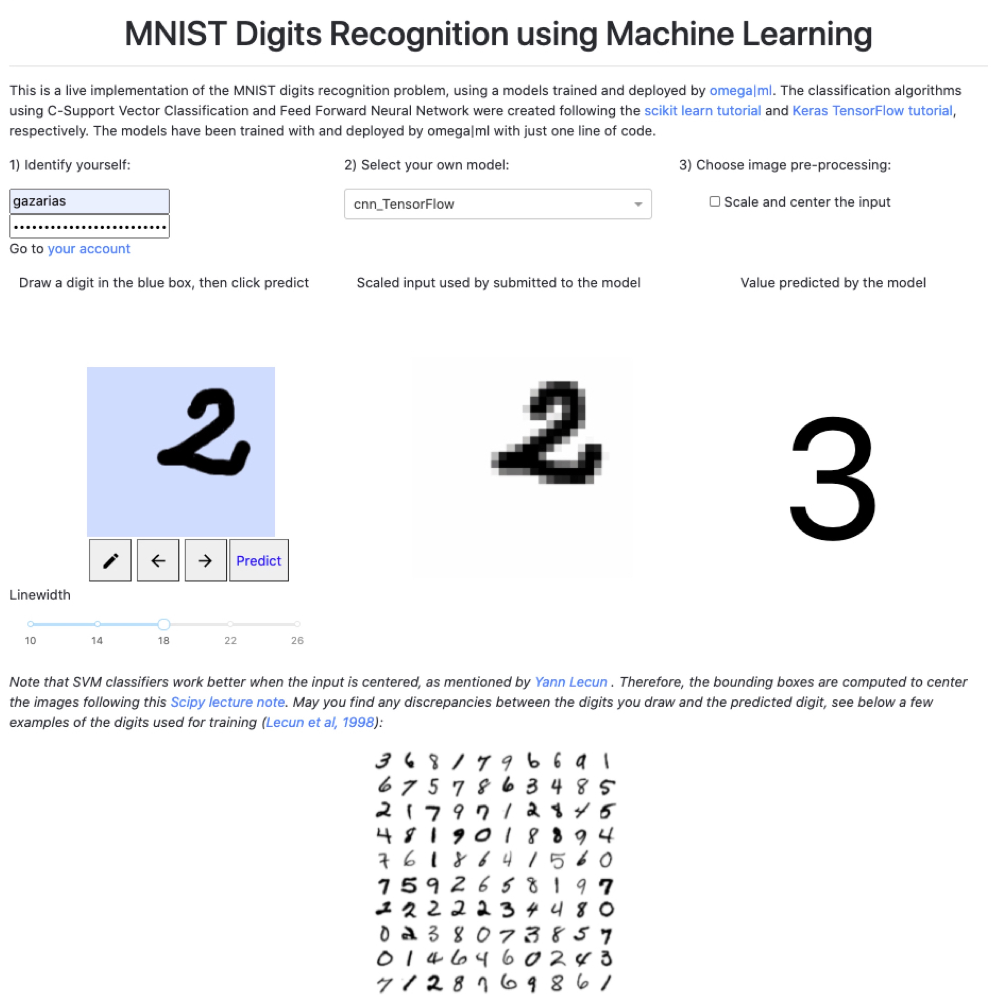

# Handwritten Digits Recognition
 Flask app to receive a user input and predict the written digit using a selected Machine Learning model

 **Content:**
 - apps: End product of the project. This folder contains the relevant files to make your application running on the web. The content was written following the tutorials from [Flask](https://flask.palletsprojects.com/en/1.1.x/) and [omega|ml](https://github.com/omegaml/apps/tree/master/helloworld)
 - development: This folder contains the files for the development of your app. The files can be used to run on a localhost using the debugging mode to rapidly build your application
 - examples: Examples of failed and successful predictions
 - models: Examples of Machine Learning models created to predict handwritten digits

**What it does:**
- Interface accessible from any device (computer, mobile) through the omega|ml apphub
- Secured model retrieval
- Prediction of handwritten digit using raw or preprocessed data
- Reference to tutorials and relevant article

**Show me:**

- Here is an example of prediction when the input is sent raw. Neither SVM nor CNN provides an accurate prediction although the accuracy on the test dataset largely exceeded 90%

- Now if you select the preprocessing option, the predictions are much more often accurate, yet the real accuracy does not reach what was found on the test dataset
\

**Lesson learned:**

Make sure that you understand your raw data and any preprocessing step that might affect your machine learning model.

**I want to try:**

Sure, the app is accessible [here](https://hub.omegaml.io/apps/gazarias/mnist/), but you will need to generate your own models to use it. Check the [omega|ml](https://www.omegaml.io/) website for more information.

> May you need any information, feel free to contact me at guillaume.azarias@hotmail.com